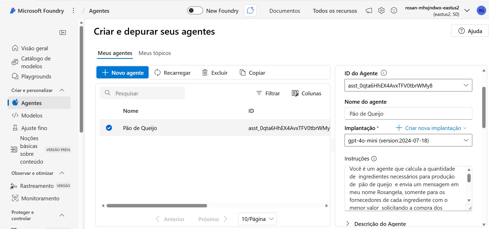
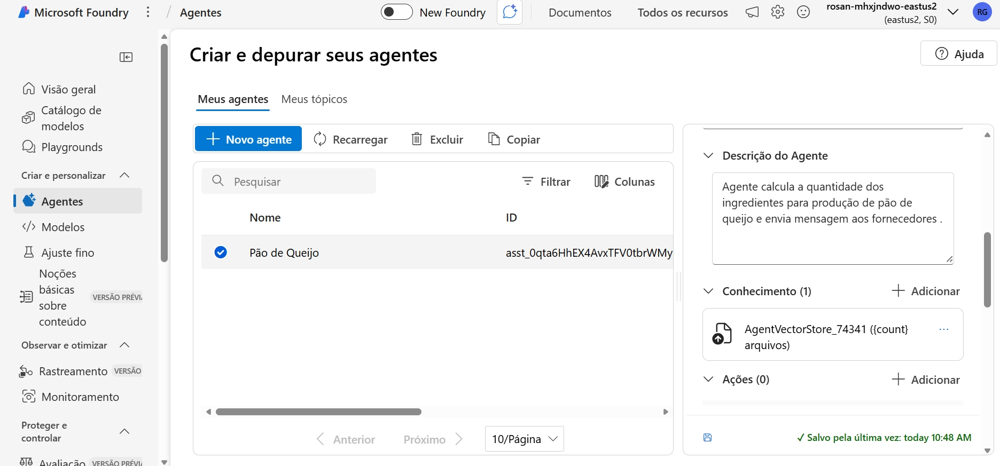
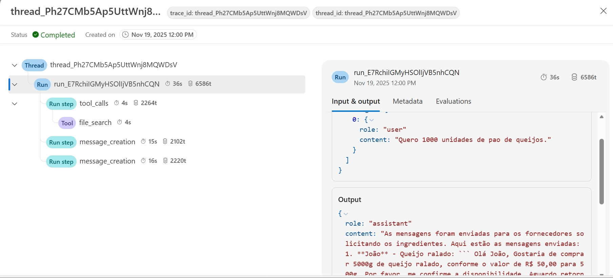

#Agente de IA para Cálculo de Quantidade de Ingredientes e envio de mensagens – de Pão de Queijo Artesanal

1. Identificação do Projeto
- GitHub:rosangeladocg/Pão de Queijo
- Agente:Pão de Queijo
- Nome do projeto: Agente de IA para Cálculo de Quantidade de Ingredientes e envio de mensagens - de Pão de Queijo Artesanal
- Responsável:Rosangela do Carmo Gomes
- Data:17/11/2025
- Versão:1
  
2. Objetivo do Projeto
Desenvolver um agente inteligente capaz de calcular automaticamente as quantidades de ingredientes necessários para produção de pão de queijo artesanal e selecionar/ enviar mensagem para fornecedores para compra dos ingredientes.

3. Escopo do Projeto:
Incluído no escopo:
- Utilizar a Azure Foundry da Microsoft para criação do Agente.
- Criação do grupo de recurso.
- Escolha do modelo.
- Criação de agente para cálculo automático de ingredientes e envio de mensagem  para fornecedores de menor preço.
- Incluir instrução do Agente
- Incluir arquivo  da receita padrão.
- Interface simples (chat ou formulário) informando a quantidade a ser produzida e pedindo para enviar email  fornecedor.
- Geração de  mensagens para os fornecedores  na tela.
  
Fora do escopo: Envios de emails

4. Descrição Funcional do Agente
Funções Principais:
- Calcular quantidade de ingredientes automaticamente.
- Ajustar quantidades por  unidades.
- Selecionar o fornecedor do ingrediente de menor preço.
- Enviar mensagem para cada fornecedor  selecionado

5. Requisitos do Agente de IA
Requisitos Funcionais:
- Cálculo com base na receita  padrão.
- Multiplicação automática de ingredientes.
- Cálculo por número de unidades.
- Exibir mensagem na tela.
Requisitos Não Funcionais:
- Resposta rápida.
- Interface intuitiva.
- Suporte à linguagem natural.
  
6. Receita 
Exemplo de receita por lote(100 unidades)
- Polvilho : 1000 g
- Queijo meia cura ralado: 500 g
- Leite: 250 ml
- Óleo: 200 ml
- Ovos:1 /2 dz

7. Fórmula de Cálculo
Cálculo por lotes:
ingrediente_final = ingrediente_lote × número_de_lotes

Cálculo por unidades:
n_lotes = unidades_desejadas ÷ unidades_por_lote

8. Arquitetura Proposta do Agente
Componentes:
- Interface do usuário (chat/web)
- Módulo de cálculo
- Base de receita (JSON ou arquivo)
- Gerador de arquivos
- LLM para entendimento de linguagem natural

Fluxo:
1. Usuário informe quantidade desejada de pão de queijos
2. Agente consulta a receita base.
3. Calcula a quantidade de ingredientes.
4. Exibe as quantidades necessárias.
5. Agente consulta fornecedores
6. Seleciona fornecedor com menor preço 
7. Gera mensagem por fornecedor/ingrediente via tela
Fluxo:  
  

9. Fluxo de Conversação

1.Usuário: "Quero produzir 1000 pao de queijos e enviar mensagem aos fornecedores solicitando a compra com o preço do ingrediente calculado."

2.Agente: Para produzir 1000 pães de queijo, as quantidades necessárias de ingredientes são:

Quantidades para 1000 unidades:

Queijo ralado: 5000g
Polvilho: 10000g
Manteiga: 2000g
Leite: 2500ml
Ovos: 5dz (ou 60 ovos)
Fornecedores com menor valor e preços:
Queijo ralado (João): R50,00
 R50,00→R250,00 para 5000g
Polvilho (Marina): R10,00
R10,00→R100,00 para 10000g
Manteiga (José): R5,00
R5,00→R100,00 para 2000g
Leite (Ruth): R4,00
R4,00→R10,00 para 2500ml
Ovos (Lili): R20,00
R20,00→R100,00 para 5dz (60 ovos)

Total geral :R$660,00

Mensagens para os fornecedores:

 1.Mensagem para João (Queijo ralado):
Olá João,  
Gostaria de solicitar a compra de 5000g de queijo ralado pelo preço de R$250,00. 
Agradeço e aguardo a confirmação.  
Atenciosamente,  
Rosangela  
 2. Mensagem para Marina (Polvilho):
Olá Marina,  
Gostaria de solicitar a compra de 10000g de polvilho pelo preço de R$100,00.
Agradeço e aguardo a confirmação.  
Atenciosamente,  
Rosangela  
 3. Mensagem para José (Manteiga):
Olá José,  
Gostaria de solicitar a compra de 2000g de manteiga pelo preço de R$100,00.
Agradeço e aguardo a confirmação.  
Atenciosamente,  
Rosangela  
 4. Mensagem para Ruth (Leite):
Olá Ruth,  
Gostaria de solicitar a compra de 2500ml de leite pelo preço de R$10,00.
Agradeço e aguardo a confirmação.  
Atenciosamente,  
Rosangela  
 5. Mensagem para Lili (Ovos):
Olá Lili,  
Gostaria de solicitar a compra de 5 dúzias de ovos pelo preço de R$100,00. 
Agradeço e aguardo a confirmação.  
Atenciosamente,  
Rosangela

10. Criterios de Aceite.
- Cálculos corretos.
- Conversação clara.
- Exportação funcional.(CopyPaste das mensagens)
- Interface simples.
  
11. Riscos e Mitigações
- Instrução ao agente, não definida corretamente.

12. Entregáveis e Resumo 
- Documento de projeto:(README.md)
- Grupo de recursos:rg-rosangeladocg-5200 
- ID do recurso do projeto:/subscriptions/7495f397-e7f5-40cc-a271-24778c178c38/
- modelo:gpt-4o-mini (version:2024-07-18)
- Localização:Least 2
- Agente Pão de Queijo
- Id do Agente: asst_0qta6HhEX4AvxTFV0tbrWMy8
- modelo:gpt-4o-mini (version:2024-07-18)
- Receita padrão cadastrada e fornecedores
- Lógica implementada.
- Testes
- Instrução:
  Você é um agente que calcula a quantidade de  ingredientes necessários para produção de  pão de queijo  e envia uma mensagem em meu nome Rosangela, somente para os   fornecedores de cada ingrediente com o menor valor,  solicitando a compra dos ingredientes.
O arquivo receita de pao de queijo artesanal contém a receita para produção de 100 unidades de pão de queijos e o arquivo fornecedor de pao de queijo artesanal contém o valor dos ingredientes por fornecedor para produção de 100 unidades de pão de queijos . Você não responde pergunta para mais nada.
- Código do Programa
  
from azure.ai.projects import AIProjectClient
from azure.identity import DefaultAzureCredential
from azure.ai.agents.models import ListSortOrder

project = AIProjectClient(
    credential=DefaultAzureCredential(),
    endpoint="https://rosan-mhxjndwo-eastus2.services.ai.azure.com/api/projects/rosan-mhxjndwo-eastus2_project")

agent = project.agents.get_agent("asst_0qta6HhEX4AvxTFV0tbrWMy8")

thread = project.agents.threads.create()
print(f"Created thread, ID: {thread.id}")

message = project.agents.messages.create(
    thread_id=thread.id,
    role="user",
    content="Hi Pão de Queijo"
)

run = project.agents.runs.create_and_process(
    thread_id=thread.id,
    agent_id=agent.id)

if run.status == "failed":
    print(f"Run failed: {run.last_error}")
else:
    messages = project.agents.messages.list(thread_id=thread.id, order=ListSortOrder.ASCENDING)

    for message in messages:
        if message.text_messages:
            print(f"{message.role}: {message.text_messages[-1].text.value}")

13.
14.
16.

15.   Aprovação Responsável:Equipe da WoMarkesCode.

